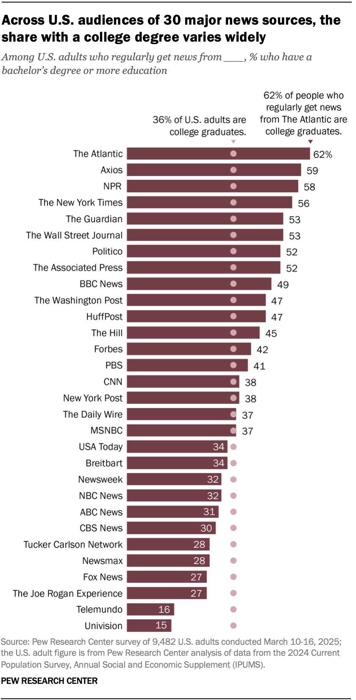

1. Start a new document, problemset3.Rmd, in your soc10problemsets repository. (You can download a template [here](https://github.com/Soc10Spring2026/soc10problemsets_templates), but be sure to save it in your own soc10problemsets repo). Change your name in the header. Load the `gapminder` data using `library(gapminder)`. Create a simple plot with two of the variables. __Commit__ your changes. 

I plotted year on the x-axis and life expectancy on the y-axis using the gapminder dataset. This shows how life expectancy has generally increased over time globally, reflecting improvements in medicine, healthcare, and living standards across the world.

```{r q1, echo = TRUE}

library(gapminder)
library(ggplot2)

ggplot(data = gapminder,
       mapping = aes(x = year, y = lifeExp)) +
  geom_point()

```

2. Now, modify your plot! For each change that you make, explain your decision, in terms of the visual elements. __Commit__ your changes. 

I made four changes to the original plot. First, I added color = continent to distinguish between continents, making it easier to see regional patterns rather than looking at all countries as one group. Second, I added alpha = 0.5 to make the points slightly transparent since there are many overlapping points, making the plot less cluttered and easier to read. Third, I added labels using labs() to give the plot a clear title and axis labels so the viewer knows exactly what they are looking at. Fourth, I changed the theme to theme_minimal() to remove the grey background and make the plot cleaner and easier to read. I use ggplot quite frequently in my lab on campus, so I felt the skills I used combined with what we've learned in class made this plot unique to complete and analyze.

```{r q2, echo = TRUE}

ggplot(data = gapminder,
       mapping = aes(x = year, y = lifeExp, color = continent)) +
  geom_point(alpha = 0.5) +
  labs(title = "Life Expectancy Over Time by Continent",
       x = "Year",
       y = "Life Expectancy",
       color = "Continent") +
  theme_minimal()

```

3. Use the code provided to load data on racial compositions in California. Then create your own visualization! Try to make it different than what is done above. Is there anything that you want to change, but are unable to? Describe what you want to communicate with these data. __Commit__ your changes. 

I created a faceted bar chart showing the percentage of each racial group in California across 2000, 2010, and 2020, with one panel per racial group. I wanted to communicate how California's racial composition has shifted over two decades. The most notable trends are that the White alone population has steadily declined from around 47% to 35%, while the Hispanic or Latino population has grown significantly. Asian populations have also grown slightly over time. One thing I wanted to change but was unable to was clearly showing the very small groups like Native American and Pacific Islander alongside larger groups, since their bars are nearly invisible at the same scale. I was however proud I was able to fix the facet label cutoff issue by using label_wrap_gen(width = 20) through researching more on ggplot and sizing of labels.

```{r q3, echo = TRUE, message = FALSE}

library(readr)
library(RCurl)
library(ggplot2)
library(tidyr)
library(magrittr)
library(dplyr)

# input url from github
url <- getURL("https://raw.githubusercontent.com/tylermcdaniel/soc10/refs/heads/deployment/Data/ca_dem_table.csv")

# download wikipedia data (from github)
ca_dem_table <- read_csv(url)


# pivot longer
ca_dem_table %<>%
  pivot_longer(cols = -c(Race),
               names_to = "Name",
               values_to = "Value") %>%
  filter(Name == "2000_pct" | Name == "2010_pct" | Name == "2020_pct") %>%
  filter(Race != "Total")

# plot
ggplot(ca_dem_table, aes(x = Name, y = Value)) +
  geom_bar(position = "dodge", stat = "identity",
           aes(fill = Name)) +
  labs(x = "", y = "Percentage of Population",
       title = "Racial Composition of California Over Time") +
  theme_minimal() +
  theme(axis.text.x = element_blank(),
        axis.ticks.x = element_blank(),
        legend.position = "bottom") +
  facet_wrap(~Race, labeller = label_wrap_gen(width = 20))

```

4. Return to a dataset you have worked with in this class already (for example, hand-collected data, data using the `data()` function. The `gtrendsR` data could also work but may need some cleaning/manipulation). Use `ggplot()` to plot this data in a new way. Describe whether the viewer learns anything new from seeing the data in this way. __Commit__ your changes.  

I replotted the gapminder data from Questions 1 and 2 in a new way by filtering to only the year 2007 and adding two additional variables which are population size shown through the size of each point and continent shown through color. This gives the viewer significantly more information than the simple scatter plots in Q1 and Q2. 

The viewer can now see several important trends simultaneously. First, there is a clear positive relationship between GDP per capita and life expectancy, meaning that countries with higher economic output tend to have longer life expectancy, likely due to better access to healthcare, nutrition, and infrastructure. Second, by adding continent as a color, we can see that countries in Africa tend to cluster at the lower end of both GDP per capita and life expectancy, reflecting the lasting economic impacts of colonialism and historical inequalities in global resource distribution. Countries in Europe and the Americas tend to cluster at higher levels of both variables. Third, the size of each point reveals population differences — large population countries like China and India fall in the middle range of GDP per capita but have seen significant improvements in life expectancy, reflecting rapid economic development and public health investments in the latter half of the 20th century.

```{r q4, echo = TRUE}

library(gapminder)
library(ggplot2)
library(dplyr)
library(magrittr)

# filter to only 2007 data
gapminder_2007 <- gapminder %>%
  filter(year == 2007)

# plot
ggplot(data = gapminder_2007,
       mapping = aes(x = gdpPercap, y = lifeExp,
                     size = pop, col = continent)) +
  geom_point(alpha = 0.7) +
  labs(title = "GDP Per Capita vs Life Expectancy in 2007",
       x = "GDP Per Capita",
       y = "Life Expectancy",
       size = "Population",
       col = "Continent") +
  theme_minimal()
```


5. Find a data visualization in the wild! It could be in the news, from an academic article, or somewhere else. Include an image of it using the `knitr::include_graphics("")` function. Describe its positive and negative aspects. __Commit__ your changes. 

This visualization comes from the Pew Research Center and shows the percentage of regular audiences of 30 major U.S. news sources who have a college degree or more.

Positive aspects: The chart is very easy to read and makes comparisons across news sources simple and the use of a single consistent color with a clear reference line showing the national average of 36% is an effective use of scale, allowing the viewer to immediately see which outlets skew toward more or less educated audiences. The dot on each bar clearly marks the national average for easy comparison, and the percentage labels on each bar make the data precise and readable. The title clearly communicates the main finding so the viewer knows exactly what they are looking at.

Negative aspects: The chart does not tell us anything about why these differences exist or what they mean sociologically. It also does not account for the size of each outlet's audience so a smaller outlet like The Atlantic having 62% college graduates may reflect a much smaller and more selective readership than a large outlet like Fox News. Additionally, the chart only measures one demographic characteristic, leaving out other important factors like age, income, or political affiliation that might better explain news consumption patterns and influence media significantly.


```{r q5, echo = TRUE}




```
